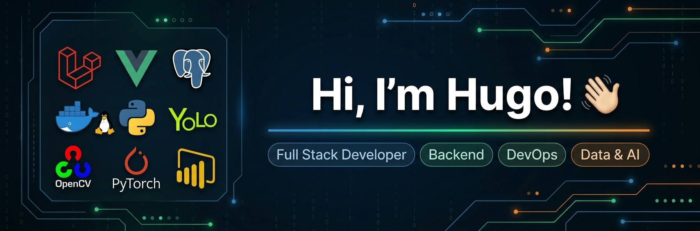

<p align="center">
  
</p>

### Full Stack Developer · Backend · DevOps · Data & AI

I build web applications, backend systems and infrastructure, with a strong focus on **reliability, automation and practical problem solving**.

My current interests are expanding into **Data Analytics, Machine Learning and AI-powered applications**.

---

## 🧑‍💻 About Me

I'm a software developer interested in building and understanding systems from end to end.

My experience covers **backend development, frontend applications, databases, Linux servers, Docker, networking and authentication**. I also enjoy working with data and experimenting with Machine Learning and AI.

I like going beyond writing code — understanding **how the application is deployed, how services communicate, how data is stored, how authentication works and how the whole system operates in production**.

Currently, I'm expanding my skills in:

* 📊 Data Analytics
* 🤖 Machine Learning
* 🧠 AI-powered applications
* 🐍 Python for Data & ML
* ☁️ Cloud & infrastructure
* 🔐 Application security

---

## 🛠️ Tech Stack

### 💻 Languages


### 🌐 Backend


### 🎨 Frontend


### 🗄️ Databases


### ⚙️ DevOps & Infrastructure


### 🔐 Authentication & Security


### 📊 Data & AI


---

## 🚀 Featured Projects

### 🗂️ Document Management Systems

Full-stack applications focused on document management, authentication, workflows and secure file handling.

**Stack:** Laravel · Vue · PostgreSQL · Docker · Nginx · Keycloak

---

### 🌱 Computer Vision & Machine Learning

Exploring computer vision for real-world agricultural applications, including object detection and image-based crop analysis.

**Stack:** Python · YOLO · OpenCV · PyTorch · ROCm

---

### 🧠 AI & Semantic Search

Building experiments around local AI, embeddings and semantic search using open-source models and vector databases.

**Stack:** Python · Ollama · PostgreSQL · pgvector · LLMs

---

### 📊 Data Analytics

Developing practical data analysis skills through SQL, Excel, Python, pandas, visualization and Power BI.

**Focus:** Data cleaning · Exploratory Data Analysis · Visualization · Machine Learning

---

## 🔭 Currently Working On

```text
┌──────────────────────────────────────────────┐
│                                              │
│  📊 Data Analytics                           │
│     SQL · Excel · pandas · Power BI          │
│                                              │
│  🤖 Machine Learning                          │
│     scikit-learn · YOLO · Computer Vision    │
│                                              │
│  🧠 AI Applications                           │
│     LLMs · Embeddings · RAG · pgvector       │
│                                              │
│  ☁️ Infrastructure                            │
│     Linux · Docker · Cloud · Networking      │
│                                              │
└──────────────────────────────────────────────┘
```

---

## 📚 What I'm Learning

* Machine Learning fundamentals
* Data Analysis & visualization
* Computer Vision
* Generative AI & LLM applications
* RAG architectures
* Vector databases
* Cloud infrastructure
* Security & authentication
* System design

---

## 💡 Development Philosophy

> Build it. Understand it. Automate it. Improve it.

I enjoy learning by building real projects and solving problems across the entire stack.

---

## 📫 Connect With Me

[]([https://github.com/](https://github.com/HugoCD20))

[](https://linkedin.com/)
